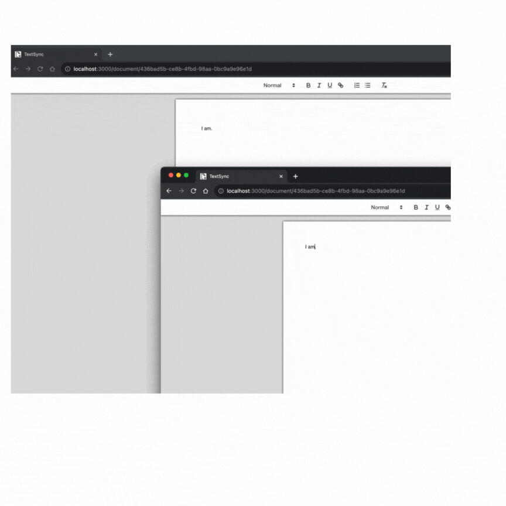
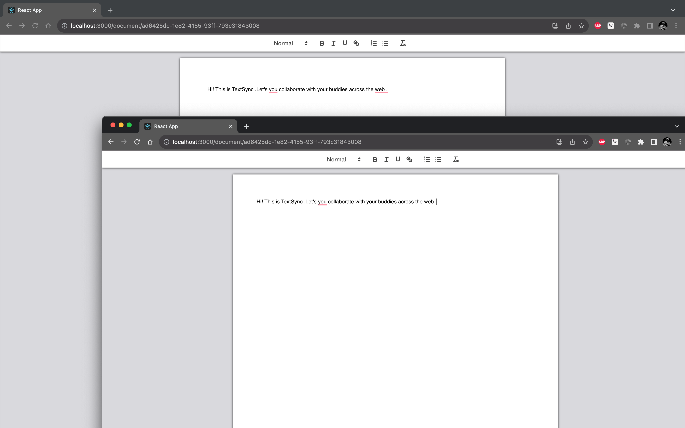

# TextSync (Docs Clone)

## Overview

TextSync is a collaborative text editor application inspired by Google Docs. It utilizes React for the frontend, Quill as the text editor, Socket.io for real-time collaboration and MongoDB for data storage.

## Frontend Setup

1. Navigate to the **client** directory.
2. Run the following command to install dependencies:

   `npm install`
   
3. Start Frontend Application using

	`yarn start	`
	
 This will launch the application on http://localhost:3000

  
## Backend Setup
1.  Navigate to the **server** directory.
    
2.  Run the following command to install backend dependencies:

	`npm install`
3. Start the Backend Server using:

	`npm run devstart`
	Update **packages.json** scripts with `"devstart": "nodemon server.js"`

## Technologies Used

-   **Frontend:**
    -   React: [React Documentation](https://reactjs.org/docs/getting-started.html)
    -   Quill: [Quill Documentation](https://quilljs.com/docs/quickstart/)
    
-   **Backend:**
    -   Socket-io: [Socket.io Documentation](https://socket.io/docs/v4/)
    -   MongoDB: [MongoDB Documentation](https://docs.mongodb.com/)
   
   ## Database Setup

TextSync uses MongoDB as its database. Ensure that you have MongoDB installed and running locally. Update the MongoDB connection string in the server's configuration file if needed.

## Local Deployment

After setting up the frontend and backend, the TextSync application will be accessible at:

-   Frontend: [http://localhost:3000](http://localhost:3000/)
-   Backend: [http://localhost:3001](http://localhost:3001/)

## Snippet

[Snippet Link](https://www.canva.com/design/DAFz9dwGM60/FfH6Es4gA76tRRyqFnXreA/watch?utm_content=DAFz9dwGM60&utm_campaign=designshare&utm_medium=link&utm_source=editor)
<!--  -->

## Additional Information

-   By default when a new tab is launched a new document is formed, to jump on same document just copy the Unique id in the route over your current id.
-   For more details about the frontend and its components, refer to the React and Quill documentation.
-   Socket.io documentation provides insights into real-time communication.
-   MongoDB documentation offers detailed information about database configurations and operations.

***Happy Collaborating with TextSync!***

